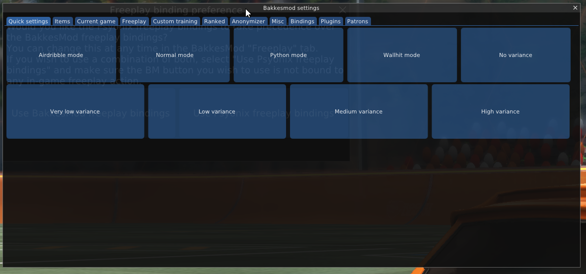

# RLRLGym
Reinforcement Learning Exploration of PPO and training methods in Rocket League


## Requirements
- A Windows 10 PC

- Rocket League (Both Steam and Epic are supported)
- Bakkesmod

- The RLGym plugin for Bakkesmod (It's installed automatically by pip)

- Python between versions 3.8

### Bakkesmod
Press F2 and it will pop-up windows like this:


## Start
- Create an Anaconda Environment

- Install requirements ([LINK](https://github.com/lucas-emery/rocket-league-gym))
```
pip install -r requirements.txt 
```
enable RLGYM plubin in Bakkesmod

## Run GPU Version
Download CUDA
Download GPU version of Pytorch
```
stable_baselines3.common.utils.get_device
```

## Training Data Visulization
```
tensorboard --logdir out/logs
```

## Evaluate Bot
- Download [RLBot](https://rlbot.org/)
- configure bot.py and bot.cfg in ```Evaluation/src```

## Reference
[RLGym Website](https://rlgym.org/docs-page.html#getting-started)

[Tutorial](https://www.youtube.com/watch?v=C92_UFZ1W-U)

[PPO Plots](https://medium.com/aureliantactics/understanding-ppo-plots-in-tensorboard-cbc3199b9ba2)